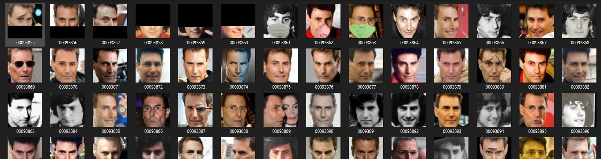

# face_augmentation_tool
A repo to augmentation your face datasets: random cut top half of face-image, random cut bottom-half and put mask on face

## Recommend: Use conda to create a virtual env for this tool.

### Install dependency Library
1. #### Create conda env:


    ```powershell
    conda create --name tool_env python=3.6

    conda activate tool_env
    ```


2. #### Install all dependency by pip
    ```powershell
    pip install -r requirements.txt
    pip install torch==1.7.0+cpu torchvision==0.8.1+cpu -f https://download.pytorch.org/whl/torch_stable.html
    ```
    
    see: https://pytorch.org/get-started/previous-versions/ for suitable version of pytorch
   
3. #### Download weight file and backbone file of (Resnet50) for Retinaface module:
    
    -   Download 2 file .pth at https://drive.google.com/drive/folders/1_MCIVXaGfsC_ZacBtVyCIX9T21lai75H?usp=sharing
    - Put 2 files above at : ****./detector/retinaface/weights/****
    
  
4. #### Prepare your data:

   - Your data should contain only face image
   - Your data should following this example path
   - Folder_data
        -   folder_1
            - image1.jpg
            - image2.jpg
        -   folder_2
            - image3.jpg
            - image4.jpg
        - ...
        -   folder_n
            - image***m-1***.jpg
            - image***m***.jpg
    - This tool will infer through your data folder and execute Augmentation on **Prob %** of total images in each folder if total images in each folder is bigger than **minimum_image** in config file.
    
 5. #### Run scripts:
    ```powershell
    python process.py
    ```
    
    For first time run, this tool will download dlib model file for Mask_module, it takes sometime.
    
 Result:
 
 
 # Reference:
 - Retinaface: https://github.com/biubug6/Pytorch_Retinaface
 - Maskface: https://github.com/aqeelanwar/MaskTheFace